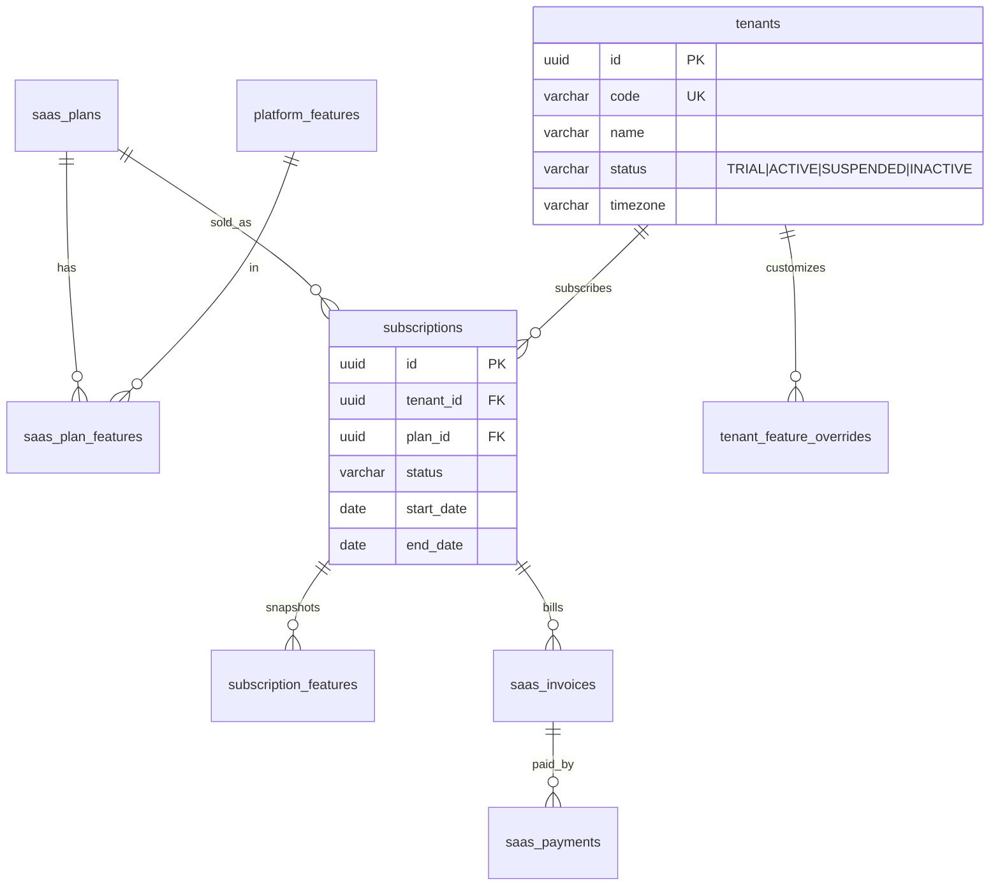
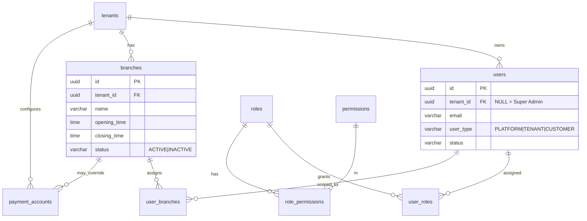
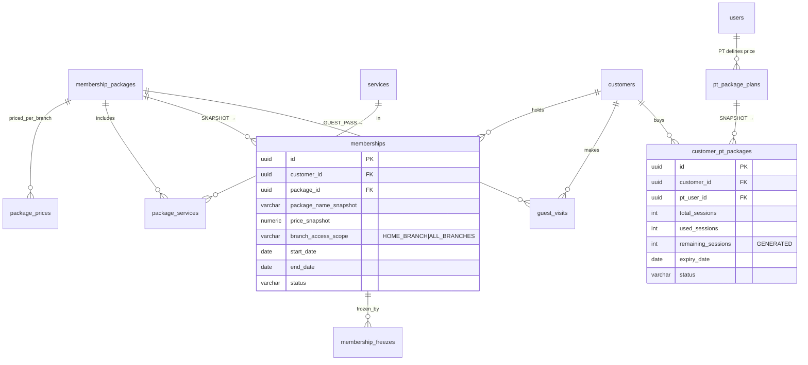
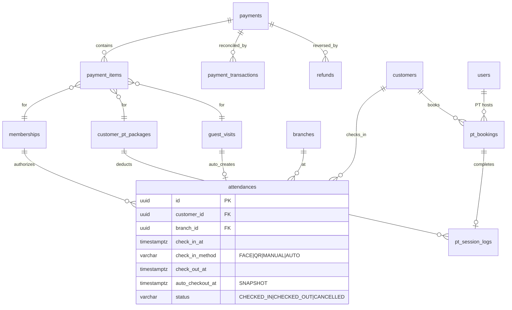

# FitFlow — THIẾT KẾ CƠ SỞ DỮ LIỆU (v1.0)

> Tài liệu này được xây dựng trực tiếp từ bản tổng hợp nghiệp vụ 6 role + Business Rule Catalog của bạn.
> DBMS mục tiêu: **PostgreSQL 15+**. Phần cuối có ghi chú chuyển đổi sang MySQL 8 / SQL Server.
> File DDL thực thi được: `fitflow_schema.sql` — **đã chạy thử trên PostgreSQL 16.14, tạo thành công 51 bảng, 0 lỗi.**
> File kiểm thử Business Rule: `fitflow_br_tests.sql` — 10 test case, đã verify DB tự chặn đúng các vi phạm BR.

---

# 0. PHẠM VI & GIẢ ĐỊNH

| Hạng mục | Quyết định |
|---|---|
| Mô hình multi-tenant | **Shared Database – Shared Schema + `tenant_id` + Row Level Security** |
| Kiểu khóa chính | `UUID` (khuyến nghị UUIDv7) — an toàn khi lộ ra API, dễ merge/sharding sau này |
| Kiểu tiền tệ | `NUMERIC(15,2)` + cột `currency` (mặc định VND) |
| Kiểu thời gian | `TIMESTAMPTZ` (lưu UTC), timezone hiển thị lấy từ Tenant/Branch |
| Enum | `VARCHAR + CHECK` thay vì `ENUM` native — dễ migration khi nghiệp vụ thêm trạng thái |
| Xóa dữ liệu | **Không xóa vật lý bất kỳ entity nghiệp vụ nào** (BR-SA-001, BR-MEMBERSHIP-004…) |

---

# 1. MƯỜI NGUYÊN TẮC THIẾT KẾ (rút ra từ nghiệp vụ của bạn)

### NT-1. Mọi bảng thuộc Tenant đều mang `tenant_id`
Kể cả khi có thể suy ra qua join (ví dụ `attendances → branches → tenants`). Đây là điều kiện bắt buộc để:
- Enforce **BR-SYSTEM-001 (Tenant Data Isolation)** ở tầng DB bằng RLS
- Mọi index đều bắt đầu bằng `tenant_id` → query luôn nằm trong 1 partition logic

### NT-2. Composite Foreign Key để chặn rò rỉ chéo Tenant
Đây là kỹ thuật quan trọng nhất của thiết kế này:

```sql
-- branches có UNIQUE (tenant_id, id)
ALTER TABLE memberships
  ADD FOREIGN KEY (tenant_id, branch_id) REFERENCES branches (tenant_id, id);
```

Kết quả: **DB tự động từ chối** một Membership của Tenant A trỏ tới Branch của Tenant B — kể cả khi tầng application có bug. Chỉ RLS thôi là chưa đủ, vì RLS bảo vệ lúc đọc, composite FK bảo vệ lúc ghi.

### NT-3. Tách Catalog (định nghĩa) khỏi Instance (đã bán) — SNAPSHOT
| Catalog (thay đổi được) | Instance (bất biến) |
|---|---|
| `membership_packages` | `memberships` |
| `pt_package_plans` | `customer_pt_packages` |
| `tenant_settings.auto_checkout` | `attendances.auto_checkout_at` |

Instance **copy cứng** giá, thời hạn, phạm vi Branch tại thời điểm bán. Đây là cách duy nhất enforce:
- **BR-MEMBERSHIP-004**: sửa Package không ảnh hưởng khách đã mua
- **BR-PT-005**: PT đổi giá không ảnh hưởng giao dịch cũ
- **Rule Auto Check-out snapshot** (mục XI tài liệu của bạn)

### NT-4. Guest KHÔNG phải một bảng người riêng
Đúng theo kết luận của bạn ở mục X: Guest là **ngữ cảnh sử dụng**, không phải role.

```
customers (1 bản ghi duy nhất cho một con người trong Tenant)
   ├── memberships     → tư cách Member
   └── guest_visits    → tư cách Guest (theo lượt)
```

Lợi ích: một người hôm nay đi Guest, tháng sau mua Membership → vẫn là **một** `customer_id`, giữ nguyên lịch sử check-in, face profile, số điện thoại. Tránh được đúng vấn đề bạn đã cảnh báo: "một người tồn tại thành hai bản ghi khác nhau".

### NT-5. Tách bạch SaaS Payment và Business Payment
Đây là điểm kiến trúc bạn nhấn mạnh ở mục V, và tôi đồng ý tuyệt đối:

| | Bảng | Ai trả | Ai nhận |
|---|---|---|---|
| SaaS | `saas_invoices` + `saas_payments` | Tenant | FitFlow |
| Business | `payments` + `payment_items` | Customer | Tenant |

Hai luồng này khác nhau về: đơn vị tiền, chu kỳ, quy trình đối soát, người xem báo cáo, và **quyền truy cập** (Super Admin ↔ Owner). Gộp chung sẽ phá vỡ BR-SYSTEM-004.

### NT-6. Feature Gating là dữ liệu, không phải if-else
`saas_plans → saas_plan_features → subscription_features (snapshot) → tenant_feature_overrides`

Enforce **BR-SA-002** và **BR-SYSTEM-005**. Cho phép bán gói ENTERPRISE tùy chỉnh mà không cần deploy code.

### NT-7. Trạng thái thay cho xóa
Mọi entity đều có cột `status` với state machine rõ ràng. `Undo Check-in` → `CANCELLED`, không `DELETE` (BR-UNDO-001/002).

### NT-8. Ràng buộc nghiệp vụ "chỉ một cái Active" enforce bằng Partial Unique Index
```sql
-- BR-PT-003: một Customer không có 2 PT Package Active
CREATE UNIQUE INDEX ON customer_pt_packages (customer_id) WHERE status = 'ACTIVE';

-- BR-MEMBERSHIP-002: không mua Membership mới khi cái cũ chưa hết hạn
CREATE UNIQUE INDEX ON memberships (customer_id) WHERE status IN ('SCHEDULED','ACTIVE','FROZEN');

-- Câu 41: đang IN_GYM thì không tạo Attendance mới
CREATE UNIQUE INDEX ON attendances (customer_id) WHERE status = 'CHECKED_IN';
```
Ba dòng index này thay thế cho hàng trăm dòng validate ở service layer, và **không thể bị race condition**.

### NT-9. Cấu hình phân cấp: Platform → Tenant → Branch
`tenant_settings` và `branch_settings` dạng key–value JSONB. Resolve theo thứ tự Branch → Tenant → Default. Tránh việc mỗi lần Owner cần một tùy chọn mới lại phải `ALTER TABLE`.

### NT-10. Audit Log là bảng riêng, append-only
Mọi hành động nhạy cảm (Undo Check-in, Suspend Tenant, Cancel Payment, đổi giá) ghi vào `audit_logs` với `before/after` dạng JSONB.

---

# 2. CHIẾN LƯỢC MULTI-TENANT

## 2.1 Vì sao chọn Shared Schema

| Mô hình | Ưu | Nhược | Kết luận |
|---|---|---|---|
| DB riêng / Tenant | Cách ly tuyệt đối | Chi phí cao, migration ×N, báo cáo toàn platform rất khó | ❌ cho MVP |
| Schema riêng / Tenant | Cách ly khá tốt | PostgreSQL đuối khi >500 schema, migration phức tạp | ❌ |
| **Shared Schema + tenant_id** | 1 migration, dashboard Super Admin dễ, chi phí thấp | Phải kỷ luật về isolation | ✅ **Chọn** |

Rủi ro duy nhất của Shared Schema là lập trình viên quên `WHERE tenant_id = ?`. Ta khóa rủi ro đó bằng **3 lớp**:

```
Lớp 1 — Application: TenantContext inject vào mọi query
Lớp 2 — Database:    Row Level Security (RLS) policy
Lớp 3 — Integrity:   Composite FK (tenant_id, id)
```

## 2.2 Row Level Security

```sql
ALTER TABLE customers ENABLE ROW LEVEL SECURITY;

CREATE POLICY tenant_isolation ON customers
  USING (tenant_id = current_setting('app.current_tenant_id')::uuid);

-- Super Admin bypass có kiểm soát
CREATE POLICY platform_admin_read ON customers FOR SELECT
  USING (current_setting('app.is_platform_admin', true) = 'true');
```

Application mở connection → `SET LOCAL app.current_tenant_id = '...'` từ JWT. Từ đó mọi query đều bị lọc tự động.

## 2.3 Branch Scope (BR-SYSTEM-003)

Branch scope **không** enforce bằng RLS (quá phức tạp và thay đổi theo nghiệp vụ), mà bằng bảng `user_branches` + kiểm tra ở tầng service:

```
Branch Manager → user_branches có thể có N dòng (quản lý nhiều chi nhánh)
Staff / PT     → thường 1 dòng
```

Lưu ý bạn đã phân biệt rất đúng ở mục XIV:
> **Customer Visibility ≠ Staff Permission**

Nghĩa là: Staff Branch B **được đọc** Customer có `ALL_BRANCHES` (để check-in), nhưng **không được ghi/undo** Attendance thuộc Branch A. Do đó:
- Đọc Customer: scope = Tenant
- Ghi Attendance/Payment: scope = Branch được gán

---

# 3. BẢN ĐỒ DOMAIN

```text
┌─────────────────────────────────────────────────────────┐
│ D1. PLATFORM (Super Admin)                              │
│ saas_plans · platform_features · saas_plan_features     │
│ tenants · subscriptions · subscription_features         │
│ tenant_feature_overrides · saas_invoices · saas_payments│
└─────────────────────────────────────────────────────────┘
┌─────────────────────────────────────────────────────────┐
│ D2. IDENTITY & ACCESS                                   │
│ users · roles · permissions · role_permissions          │
│ user_roles · user_branches                              │
└─────────────────────────────────────────────────────────┘
┌─────────────────────────────────────────────────────────┐
│ D3. ORGANIZATION (Owner)                                │
│ branches · tenant_settings · branch_settings            │
│ payment_accounts                                        │
└─────────────────────────────────────────────────────────┘
┌─────────────────────────────────────────────────────────┐
│ D4. PEOPLE                                              │
│ staff_profiles · pt_profiles · pt_certificates          │
│ pt_working_hours · customers                            │
│ face_profiles · face_embeddings                         │
└─────────────────────────────────────────────────────────┘
┌─────────────────────────────────────────────────────────┐
│ D5. CATALOG                                             │
│ services · membership_packages · package_prices         │
│ package_services · package_branches · pt_package_plans  │
└─────────────────────────────────────────────────────────┘
┌─────────────────────────────────────────────────────────┐
│ D6. SALES / SUBSCRIPTION CỦA KHÁCH                      │
│ memberships · membership_freezes                        │
│ customer_pt_packages · guest_visits                     │
└─────────────────────────────────────────────────────────┘
┌─────────────────────────────────────────────────────────┐
│ D7. PAYMENT (Business)                                  │
│ payments · payment_items · payment_transactions         │
│ refunds                                                 │
└─────────────────────────────────────────────────────────┘
┌─────────────────────────────────────────────────────────┐
│ D8. OPERATIONS                                          │
│ attendances · access_denied_logs · checkin_devices      │
│ pt_bookings · pt_session_logs                           │
│ notification_rules · notifications                      │
│ audit_logs · daily_branch_stats                         │
└─────────────────────────────────────────────────────────┘
```

---

# 4. ERD THEO DOMAIN

## 4.1 Platform / SaaS



## 4.2 Identity & Organization



## 4.3 Catalog → Sales (trục snapshot)



## 4.4 Payment & Operations



---

# 5. ĐẶC TẢ CÁC BẢNG TRỌNG YẾU

Chi tiết đầy đủ nằm trong `fitflow_schema.sql`. Dưới đây là **những cột mang nghiệp vụ** cần giải thích.

## 5.1 `tenants`

| Cột | Ý nghĩa |
|---|---|
| `status` | `TRIAL → ACTIVE → SUSPENDED → INACTIVE`. Không bao giờ DELETE (BR-SA-001) |
| `suspended_at`, `suspended_reason` | Phục vụ audit khi Super Admin khóa vì không thanh toán |
| `timezone` | Cần thiết để tính "Revenue Today", "Check-in Today" đúng múi giờ Tenant |
| `data_retention_days` | Chuẩn bị cho chính sách xóa dữ liệu khi Tenant INACTIVE lâu |

## 5.2 `users` — bảng gây tranh cãi nhất

Tôi chọn **một bảng `users` duy nhất** với `tenant_id NULLABLE`:

```sql
user_type: PLATFORM (Super Admin) | TENANT (Owner/BM/Staff/PT) | CUSTOMER
CHECK: user_type = 'PLATFORM' ⟺ tenant_id IS NULL
```

**Lý do:** luồng authentication dùng chung, tránh 2 hệ thống login song song.
**Rủi ro & cách xử lý:** Super Admin nằm cùng bảng với user Tenant → dùng CHECK constraint + RLS policy riêng, và **không** cấp quyền `INSERT` role `SUPER_ADMIN` cho bất kỳ API nào của Tenant (khớp với rule "Owner không được tạo Super Admin").

Unique email phải theo Tenant, không toàn cục:
```sql
UNIQUE (tenant_id, lower(email))     -- user của Tenant
UNIQUE (lower(email)) WHERE tenant_id IS NULL  -- Super Admin
```
Điều này cho phép cùng một email là khách của ABC Fitness và California Gym.

## 5.3 `customers` — trung tâm của D4

| Cột | Ghi chú nghiệp vụ |
|---|---|
| `customer_code` | Unique theo Tenant, dùng cho Manual Check-in (BR-CHECKIN-003) |
| `phone` | Định danh tìm kiếm chính. Partial unique theo Tenant |
| `full_name` | **Không** unique — bạn đã ghi rõ "Tên không phải định danh duy nhất" |
| `home_branch_id` | Branch đăng ký gốc, dùng cho `HOME_BRANCH` scope |
| `qr_token` | **Token ngẫu nhiên, KHÔNG chứa thông tin cá nhân** — đúng khuyến nghị của bạn |
| `qr_token_version` | Cho phép revoke QR khi khách mất điện thoại |
| `user_id` | Nullable — khách vãng lai chưa cần tài khoản app |
| `first_seen_as` | `GUEST` / `MEMBER`, chỉ phục vụ báo cáo chuyển đổi |
| `status` | `ACTIVE / INACTIVE` — Owner không xóa vật lý |

## 5.4 `membership_packages` — bao gồm cả Guest Pass

```sql
package_type: 'MEMBERSHIP' | 'GUEST_PASS'
```

**Lý do gộp:** Guest Pass ("gói tập 1 buổi") chia sẻ **toàn bộ** cơ chế với Membership Package: giá theo Branch, gắn Service, Activate/Deactivate, không được xóa khi đã bán. Tách ra 2 bảng sẽ phải nhân đôi `package_prices`, `package_services`, và logic báo cáo doanh thu.

Các cột chính:

| Cột | Ghi chú |
|---|---|
| `duration_value` + `duration_unit` | `DAY/WEEK/MONTH/QUARTER/YEAR`. Guest Pass = 1 DAY |
| `branch_access_scope` | `HOME_BRANCH` / `ALL_BRANCHES` — **không hard-code tên "VIP"** (BR-MEMBERSHIP-007) |
| `max_checkins_per_day` | `NULL` = không giới hạn (BR-MEMBERSHIP-008). Guest Pass = 1 |
| `base_price` | Giá mặc định; `package_prices` override theo Branch (BR-MEMBERSHIP-005) |
| `status` | `ACTIVE / INACTIVE`. Không DELETE khi đã có người mua |

**Phân biệt 2 khái niệm dễ nhầm:**
- `package_branches` = Branch nào được **bán** gói này
- `branch_access_scope` = Khách **dùng** được ở đâu

## 5.5 `memberships` — bảng snapshot quan trọng nhất

```sql
-- Snapshot tại thời điểm bán (không bao giờ đổi)
package_name_snapshot, price_snapshot, duration_value_snapshot,
duration_unit_snapshot, branch_access_scope_snapshot, max_checkins_per_day_snapshot
```

Vì sao? Owner đổi giá gói "Basic 1 tháng" từ 500k → 600k. Nếu `memberships` chỉ giữ `package_id`, thì mọi báo cáo doanh thu quá khứ **thay đổi ngược**, và hợp đồng đã bán bị hiểu sai. Snapshot giải quyết triệt để **BR-MEMBERSHIP-004** và **BR-MEMBERSHIP-010**.

Trạng thái: `SCHEDULED → ACTIVE → EXPIRED`, nhánh phụ `FROZEN`, `CANCELLED`.
- `SCHEDULED`: đã mua nhưng `start_date` ở tương lai (BR-MEMBERSHIP-003 — Owner/Staff chọn ngày bắt đầu)
- `previous_membership_id`: dựng chuỗi gia hạn, phục vụ báo cáo retention

## 5.6 `guest_visits`

```
PENDING_PAYMENT ──PAID──→ ACTIVE (auto check-in)
       │                     │
       │                     ├──→ ON_HOLD ──Resume──→ ACTIVE
       ├──→ CANCELLED        │
       └──→ EXPIRED          └──→ COMPLETED
```

Ánh xạ trực tiếp BR-GUEST-001…004 và luồng Guest On Hold bạn đã chốt:
- `attendance_id`: Attendance được tạo tự động khi `PAID` (BR-GUEST-002)
- `held_at`, `hold_reason`, `resumed_at`: phục vụ Guest On Hold — **không Undo Check-in**, đúng quyết định của bạn
- `UNIQUE (payment_id)`: một Payment = một lượt (BR-GUEST-003)

## 5.7 `customer_pt_packages`

| Cột | Ghi chú |
|---|---|
| `pt_user_id` | NOT NULL — **BR-PT-001**, bắt buộc gắn 1 PT |
| `membership_id` | Membership đang Active tại thời điểm mua (**BR-PT-002**), giữ để audit |
| `total_sessions`, `used_sessions` | `remaining_sessions` là `GENERATED ALWAYS AS (total - used) STORED` |
| `expiry_date` | NULL = không giới hạn (BR-PT-004, do Owner cấu hình) |
| `price_snapshot`, `pt_name_snapshot` | BR-PT-005 |

Partial unique index cho **BR-PT-003** (một PT Package Active tại một thời điểm).

## 5.8 `payments` + `payment_items`

Tôi **không** dùng polymorphic FK (`ref_type` + `ref_id`) vì mất toàn vẹn tham chiếu. Thay vào đó:

```sql
CREATE TABLE payment_items (
    membership_id           UUID NULL REFERENCES memberships(id),
    customer_pt_package_id  UUID NULL REFERENCES customer_pt_packages(id),
    guest_visit_id          UUID NULL REFERENCES guest_visits(id),
    CHECK (num_nonnulls(membership_id, customer_pt_package_id, guest_visit_id) = 1)
);
```

Vẫn giữ được FK thật, vẫn cho phép một Payment gồm nhiều item (Membership + PT Package cùng lúc).

**`payment_transactions`** là bảng đối soát QR/webhook — quan trọng hơn nhiều người nghĩ:
```sql
UNIQUE (provider, provider_txn_id)   -- idempotency, chống ghi nhận trùng
raw_payload JSONB                    -- lưu nguyên callback để đối soát
```

**Payment đã PAID không sửa/xóa (BR-PAY-005)** → mọi điều chỉnh đi qua bảng `refunds`.

## 5.9 `attendances` — bảng nóng nhất hệ thống

| Cột | Ghi chú |
|---|---|
| `membership_id` / `guest_visit_id` | CHECK: đúng một trong hai NOT NULL |
| `check_in_method` | `FACE / QR / MANUAL / AUTO` — 3 phương thức chỉ khác ở bước identify |
| `auto_checkout_duration_minutes` | **SNAPSHOT** cấu hình tại thời điểm check-in |
| `auto_checkout_at` | `GENERATED ALWAYS AS (check_in_at + interval)` — Owner đổi 4h→6h lúc 09:00 **không** ảnh hưởng khách đã vào lúc 08:00 |
| `face_match_score` | Lưu độ tin cậy để tinh chỉnh ngưỡng nhận diện |
| `device_id` | Thiết bị nào thực hiện — hỗ trợ CHECK-IN MODE / CHECK-OUT MODE tách biệt |
| `status` | `CHECKED_IN / CHECKED_OUT / CANCELLED` (Undo → CANCELLED, BR-UNDO-002) |
| `cancelled_by`, `cancel_reason`, `cancelled_at` | BR-UNDO-003 |

`auto_checkout_at` là generated column → job quét chỉ cần:
```sql
UPDATE attendances SET status='CHECKED_OUT', check_out_method='AUTO', check_out_at = auto_checkout_at
WHERE status='CHECKED_IN' AND auto_checkout_at <= now();
```

**`access_denied_logs`** — bảng tôi khuyến nghị bổ sung (chưa có trong tài liệu của bạn): ghi lại các lần từ chối (Membership EXPIRED, sai Branch, Face fail). Giá trị: Staff giải thích được cho khách, Owner thấy được số khách hết hạn đang quay lại → cơ hội bán gia hạn.

## 5.10 `pt_bookings` + `pt_session_logs`

**Chống trùng lịch PT bằng Exclusion Constraint** (không thể race condition):
```sql
EXCLUDE USING gist (
    pt_user_id WITH =,
    tstzrange(scheduled_start, scheduled_end) WITH &&
) WHERE (status IN ('SCHEDULED','CONFIRMED'))
```

**Trừ buổi tập** đúng theo rule của bạn — chỉ trừ khi `COMPLETED`, không trừ khi Booking:
```
pt_bookings.status = COMPLETED
        ↓ (trigger / service)
INSERT pt_session_logs (delta = -1, reason='SESSION_COMPLETED')
        ↓
customer_pt_packages.used_sessions += 1
```

`pt_session_logs` là **sổ cái (ledger)**, không phải chỉ counter. Nhờ đó khi cần hoàn buổi (PT hủy, khách khiếu nại) chỉ cần thêm dòng `delta = +1` — vẫn giữ nguyên lịch sử.

## 5.11 `tenant_settings` / `branch_settings`

Key chuẩn hóa (đề xuất):

| Key | Kiểu | Ví dụ |
|---|---|---|
| `checkin.enabled_methods` | array | `["FACE","QR","MANUAL"]` |
| `checkout.enabled_methods` | array | `["QR","FACE","MANUAL","AUTO"]` |
| `checkout.auto_duration_minutes` | int | `240` |
| `membership.renewal_start_policy` | enum | `NEXT_DAY_AFTER_EXPIRY` / `CHOOSE_DATE` |
| `membership.default_access_scope` | enum | `HOME_BRANCH` |
| `pt.allowed_validity_days` | array | `[30,60,90,null]` |
| `pt.package_requires_approval` | bool | `true` |
| `notification.membership_expiring_days` | array | `[7,3,1]` |

Resolve: `branch_settings` → `tenant_settings` → hằng số hệ thống.

---

# 6. MA TRẬN TRUY VẾT: BUSINESS RULE → CƠ CHẾ DATABASE

| BR | Nội dung | Cơ chế enforce |
|---|---|---|
| BR-SYSTEM-001 | Tenant Data Isolation | `tenant_id` + RLS + composite FK |
| BR-SYSTEM-002 | Owner scope = Tenant | RLS + `users.tenant_id` |
| BR-SYSTEM-003 | Branch scope | `user_branches` + service layer |
| BR-SYSTEM-004 | Super Admin không vận hành | Role/permission + audit bắt buộc khi truy cập data Tenant |
| BR-SYSTEM-005 | Feature theo Subscription | `subscription_features` + `tenant_feature_overrides` |
| BR-SA-001 | Không DELETE Tenant | Không có API DELETE; `status` |
| BR-SA-002 | Chỉ dùng feature trong Plan | `subscription_features.is_enabled` |
| BR-MEMBERSHIP-001 | Member Active mua được PT Package | `customer_pt_packages.membership_id` NOT NULL + validate |
| BR-MEMBERSHIP-002 | Không mua Membership mới khi chưa hết hạn | **Partial unique index** trên `memberships(customer_id)` |
| BR-MEMBERSHIP-003 | Chọn ngày bắt đầu | `status='SCHEDULED'` + `start_date` |
| BR-MEMBERSHIP-004 | Sửa Package không ảnh hưởng khách | **Snapshot columns** |
| BR-MEMBERSHIP-005 | Giá theo Branch | `package_prices(package_id, branch_id)` |
| BR-MEMBERSHIP-006/007 | HOME_BRANCH / ALL_BRANCHES | `branch_access_scope` enum, không hard-code "VIP" |
| BR-MEMBERSHIP-008 | Không giới hạn check-in/ngày | `max_checkins_per_day IS NULL` |
| BR-MEMBERSHIP-009 | EXPIRED không check-in, không xóa | `status='EXPIRED'` + `access_denied_logs` |
| BR-PT-001 | PT Package gắn 1 PT | `pt_user_id NOT NULL` |
| BR-PT-003 | 1 PT Package Active | **Partial unique index** |
| BR-PT-004 | Thời hạn do Owner cấu hình | `tenant_settings.pt.allowed_validity_days` |
| BR-PT-005 | PT quy định giá, không đổi giao dịch cũ | `pt_package_plans.price` + `price_snapshot` |
| BR-PAY-001..006 | Payment lifecycle | `payments.status` CHECK + trigger chặn UPDATE khi PAID |
| BR-GUEST-001..004 | Guest flow | `guest_visits.status` + `UNIQUE(payment_id)` |
| BR-CHECKIN-001..005 | Check-in validate | Service layer + `attendances` constraints |
| Câu 41 | Đang IN_GYM → báo, không tạo mới | **Partial unique index** `attendances(customer_id) WHERE CHECKED_IN` |
| Auto Check-out snapshot | Mục XI | `auto_checkout_duration_minutes` + generated `auto_checkout_at` |
| BR-UNDO-001..003 | Undo không xóa | `status='CANCELLED'` + `cancelled_by/reason/at` + `audit_logs` |

---

# 7. STATE MACHINE CHÍNH THỨC

```text
TENANT           TRIAL → ACTIVE → SUSPENDED → INACTIVE
                                ↘ ACTIVE (reactivate)

SUBSCRIPTION     TRIAL → ACTIVE → PAST_DUE → SUSPENDED → EXPIRED
                              ↘ CANCELLED

MEMBERSHIP       SCHEDULED → ACTIVE → EXPIRED
                              ↕ FROZEN
                              ↘ CANCELLED

PT PACKAGE       ACTIVE → COMPLETED (dùng hết buổi)
                       → EXPIRED   (hết hạn còn buổi)
                       → CANCELLED

GUEST VISIT      PENDING_PAYMENT → ACTIVE → COMPLETED
                                     ↕ ON_HOLD
                       → CANCELLED / EXPIRED

PAYMENT          PENDING → PAID → (REFUNDED)
                        → CANCELLED
                        → EXPIRED

ATTENDANCE       CHECKED_IN → CHECKED_OUT
                            → CANCELLED (undo)

PT BOOKING       SCHEDULED → CONFIRMED → COMPLETED
                                       → NO_SHOW
                          → CANCELLED
```

---

# 8. INDEX & HIỆU NĂNG

## 8.1 Nguyên tắc: mọi index đều bắt đầu bằng `tenant_id`

```sql
-- Check-in: query nóng nhất, phải < 50ms cho Face Recognition
CREATE INDEX ix_att_open ON attendances (tenant_id, branch_id, status)
    WHERE status = 'CHECKED_IN';

-- Tìm khách ở quầy (Staff)
CREATE INDEX ix_cus_phone ON customers (tenant_id, phone);
CREATE INDEX ix_cus_code  ON customers (tenant_id, customer_code);
CREATE INDEX ix_cus_name  ON customers USING gin (tenant_id, full_name gin_trgm_ops);

-- Validate membership khi check-in
CREATE INDEX ix_mem_active ON memberships (tenant_id, customer_id, status, end_date)
    WHERE status = 'ACTIVE';

-- Dashboard doanh thu
CREATE INDEX ix_pay_paid ON payments (tenant_id, branch_id, paid_at)
    WHERE status = 'PAID';
```

## 8.2 Partitioning (khi >10 triệu dòng)

Các bảng cần partition theo **RANGE(created_at) theo tháng**:
- `attendances`
- `audit_logs`
- `notifications`
- `access_denied_logs`

## 8.3 Bảng tổng hợp cho Dashboard

**Không** tính `SUM(revenue)` real-time trên `payments` cho dashboard của Owner (Owner nhìn toàn Tenant, có thể là 20 Branch × 3 năm dữ liệu).

```sql
CREATE TABLE daily_branch_stats (
    tenant_id, branch_id, stat_date,
    active_members, expired_members, new_members,
    checkin_count, guest_count, unique_visitors,
    membership_revenue, pt_revenue, guest_revenue, total_revenue,
    pt_session_completed,
    PRIMARY KEY (tenant_id, branch_id, stat_date)
);
```
Job chạy 1 lần/ngày + cập nhật incremental cho ngày hiện tại. Dashboard đọc từ bảng này → luôn < 10ms.

## 8.4 Face Recognition

```sql
CREATE TABLE face_embeddings (
    embedding  vector(512),   -- pgvector
    model_version VARCHAR(50) -- bắt buộc: đổi model phải re-index
);
CREATE INDEX ON face_embeddings USING hnsw (embedding vector_cosine_ops);
```

Cho phép **nhiều embedding / khách** (nhiều góc, có kính / không kính) → tăng độ chính xác đáng kể so với 1 vector.

Lưu ý phạm vi tìm kiếm: 1:N search phải giới hạn trong `tenant_id` (và nên giới hạn theo Branch nếu Tenant lớn) — vừa nhanh hơn vừa đúng BR-SYSTEM-001.

---

# 9. BẢO MẬT & DỮ LIỆU SINH TRẮC HỌC

Đây là phần dễ bị bỏ qua nhưng có rủi ro pháp lý cao (Nghị định 13/2023/NĐ-CP về bảo vệ dữ liệu cá nhân — dữ liệu sinh trắc học thuộc nhóm **nhạy cảm**):

| Yêu cầu | Cột / cơ chế |
|---|---|
| Đồng ý của khách | `customers.face_consent_at`, `face_consent_ip` |
| Rút lại đồng ý | `face_profiles.status = 'REVOKED'` + xóa embedding |
| Không lưu ảnh gốc nếu không cần | Chỉ lưu `embedding`; `image_url` optional, khuyến nghị TTL |
| Mã hóa | Cột nhạy cảm (`password_hash`, `embedding`, `payment_accounts.account_number`) dùng encryption at rest |
| Ai đã xem dữ liệu khách | `audit_logs` bắt buộc cho mọi truy cập của Super Admin vào data Tenant |

---

# 10. LỘ TRÌNH: MVP → PHASE 2

## MVP (làm ngay — 30 bảng)
D1 (rút gọn: bỏ `saas_invoices/payments`, quản lý thủ công) · D2 · D3 · D4 · D5 · D6 · D7 (bỏ `refunds`) · `attendances` · `pt_bookings` · `audit_logs`

## Phase 2
`membership_freezes` · `refunds` · `daily_branch_stats` · `notification_rules` chi tiết · `checkin_devices` · partitioning · Support Ticket

## Không làm ở MVP (đúng như bạn đã xác định)
Discount/Promotion · Payroll/Commission PT · Multi-currency · Custom Role (đang là Fixed Role)

---

# 11. NHỮNG ĐIỂM CẦN BẠN CHỐT TIẾP

Đây là các chỗ thiết kế đã chừa sẵn nhưng nghiệp vụ chưa quyết:

1. **PT có được Check-in/Check-out khách không?** — Pt không được check-in khách
2. **Membership Freeze** — Freeze thì `end_date` dời ra bao nhiêu? sẽ dời ra do owner quy định
3. **PT Booking Cancellation Policy** — không cho phép hủy khi đăng ký các gói PT, No-show không bị trừ buổi PT (thời gian tập PT sẽ luôn được tính thực tế so với số ngày member đến tập, trong trường hợp member hết hạn ngày tập mà vẫn còn thời gian tập trong gói với PT thì sẽ yêu cầu khách đăng ký gói tập thêm ngày mới, nếu không thì gói tập PT sẽ tạm dừng hoạt động với member đó) (Ảnh hưởng trực tiếp `pt_session_logs`.)
4. **Refund** — khách không được phép hủy khi đã đăng ký, chỉ có thể tạm ngưng hoạt động gói đăng ký ( đóng băng gói) Ảnh hưởng bảng `refunds` và báo cáo doanh thu.
5. **PT Package Approval** — Bạn đề xuất luồng `PT tạo → Owner duyệt → ACTIVE`. Đây là luồng **optional** , Schema đã có `status='PENDING_APPROVAL'` + `approved_by`, nhưng cần cấu hình bật/tắt (`tenant_settings.pt.package_requires_approval`).
6. **Payment Account theo Branch** — Bạn có ghi "có thể mở rộng Branch". Schema đã hỗ trợ (`payment_accounts.branch_id` nullable). Cần chốt MVP có dùng không. đúng
7. **Guest có bắt buộc số điện thoại không?** — Ảnh hưởng ràng buộc unique và khả năng nhận diện khách quay lại. có
8. **Một người có thể vừa là PT vừa là Staff không?** — Nếu có, `user_roles` phải cho phép nhiều dòng; nếu không, thêm unique constraint. không

---


